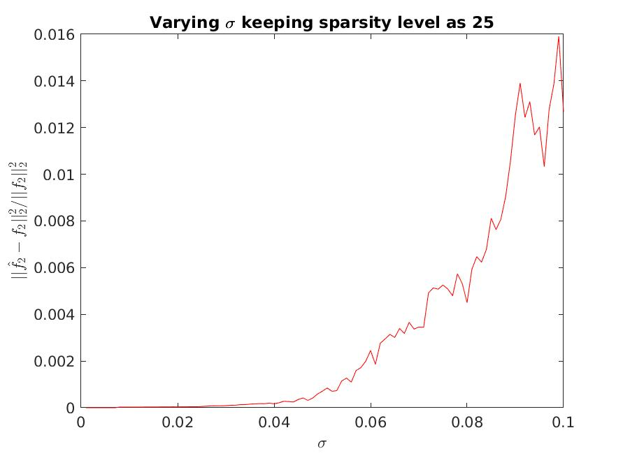
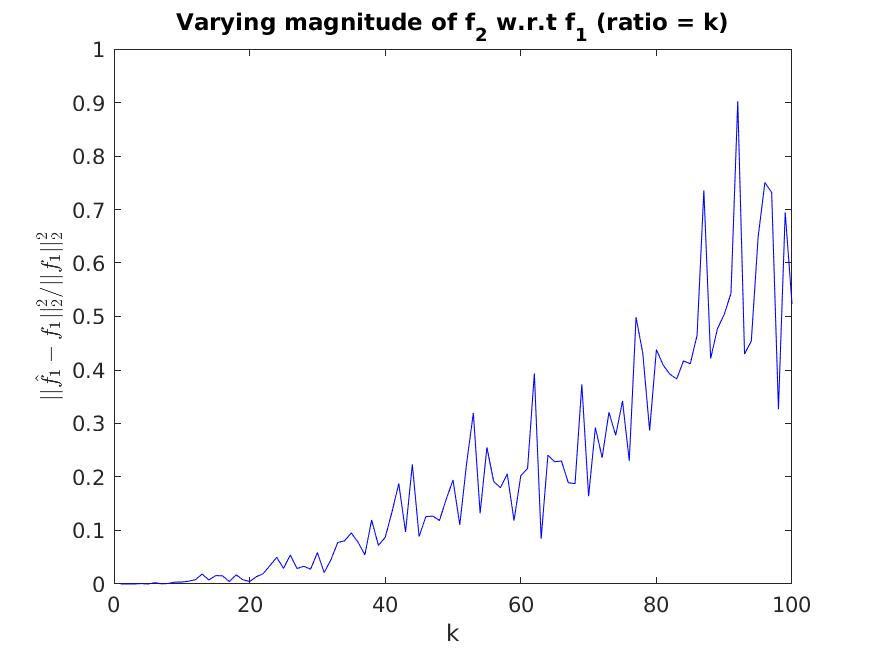
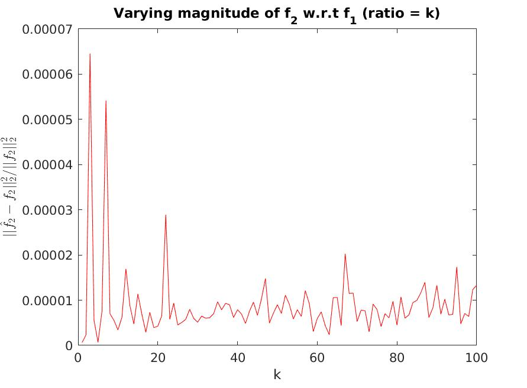

# Over-complete Dictionary

Signals are often represented as a linear combination of basis functions (like Fourier, Cosine or Wavelet representations).  
The basis functions always have the same dimensionality as the (discrete) signals they represent.  
The number of basis functions is traditionally the same as the dimensionality of the signals they represent.  
A more general representation for signals uses so called “over-complete dictionaries”, where the number of basis functions is **more** than the dimensionality of the signals.

With complete bases, the representation of the signal is always **unique**.  
This uniqueness is **lost** with over-complete basis.  
Since a signal can have many representations in an over-complete basis, we pick the **sparsest** one  
Over-complete bases afford much greater compactness in signal representation.

## Cosines + Spikes

If the signal is a linear combination of cosine functions, then it can be sparsely represented using Discrete Cosine Transform (DCT).  
If the signal is a linear combination of spike functions, then it is sparsely represented in time domain (Identity Transform).

However, if have a signal which is a linear combination of cosine functions and spike functions, it can't be represented sparsely in either of the bases (DCT or Identity).

If we create a basis (**A**) as a union of DCT and Identity, then the signal can be represented sparsely as the cosine components can be sparsely represented by DCT basis and the spikes can be sparsely represented by Identity basis.

Finding sparsest representation of signal in basis **A** is a NP-hard problem, so we use approximation algorithm - Orthogonal Matching Pursuit (OMP) to get the representation.

We use the sparsity constraint to remove noise added to the signal.

## Code

Code for OMP is present in form of a function in `omp.m`  
Code for Experiments is present in form of a function in `main.m`

Execute `main.m` in MATLAB to reproduce the results. You can adjust the parameters like dimension of signal and number of experiments in `main.m`.  
The code is tested on MATLAB 2020b, but should work on other versions of MATLAB with no or little changes.

## Results

The signal **f** is linear combination of **f1** : a **s**-sparse signal in DCT basis, **f2** : a **s**-sparse signal (in Identity basis), and Gaussian Noise with standard deviation **sigma**.  
The magnitude of sparse coefficients of **f2** is **k** times that of **f1**.

We run three types of experiments for 256-dimensional signals:

1. Varying **sigma** from 0.001\*avg(**f**) to 0.1\*avg(**f**) with **s** fixed as 25 and **k** fixed as 1.
2. Varying **s** from 1 to 100 with **sigma** fixed as 0.01\*avg(**f**) and **k** fixed as 1.
3. Varying **k** from 1 to 100 with **sigma** fixed as 0.01\*avg(**f**) and **s** fixed as 25.

### Varying sigma

 

### Varying sparsity

 

### Varying k

 

## Conclusions

- We see gradual increase in reconstruction error for both **f1** and **f2** as **sigma** increases.
- Reconstruction error is negligible/acceptable till around sparsity level **s** of about 64 (25% of n=256).  
  We see a sudden rise in error crossing 1 by sparsity level **s** of 70.
- If we zoom into the first part of the plot, we will see a very slow rise (not consistent but visible) in reconstruction error for both **f1** and **f2** with increase in sparsity level **s**.
- We can clearly see increase in reconstruction error for **f1** as **k** increases.  
  However, the reconstruction error for **f2** is almost consistent at around 0.00001.
- A possible explanation to this is the decrease in significance of **f1** in **f**, so the error bound in OMP exits when the error value of **f2** is less as error value of **f1** becomes less significant with increase in **k**.
- To add to that, **sigma** is based on the average value of **f1** + **f2**, which increases while the average value of **f1** remains same, thus giving similar results as the experiment when we were varying **sigma**.  
  For **f2**, increase in **sigma** is counter-acted by the increase in average value of **f2**, thus giving us almost consistent reconstruction error.
